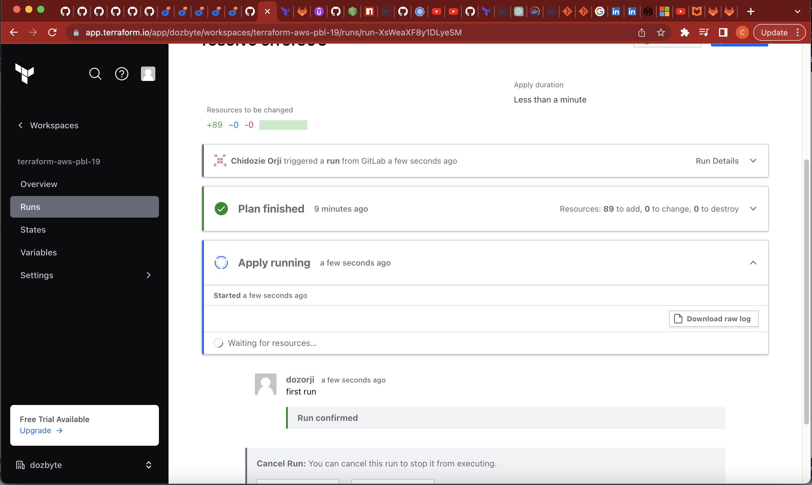
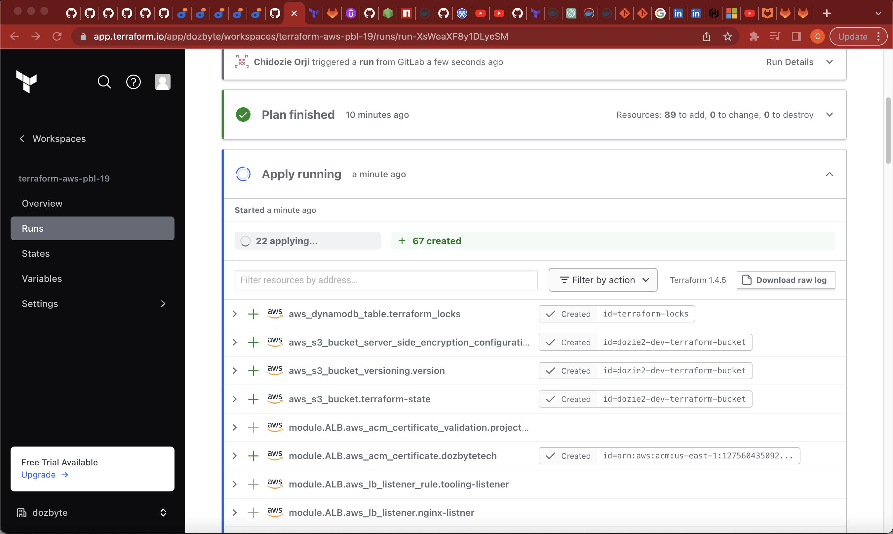
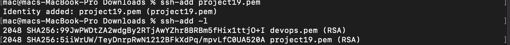
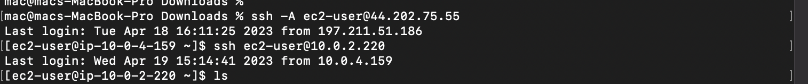

# AUTOMATING INFRASTRUCTURE WITH IAC USING TERRAFORM PART 4 – TERRAFORM CLOUD
## INTRODUCTION
In this project, instead of running the Terraform codes in project 18 from a command line, rather it is being executed from Terraform cloud console. The AMI is built differently with packer while Ansible is used to configure the infrastructure after its been provisioned by Terraform.

The following outlines the steps:

## STEP 1: Setting Up A Terraform Account

- After verifying my email and creating an organisation in the terraform cloud site, then on the **configure workspace** page, selecting **version control workflow** option inorder to run Terraform commands triggered from my git repository.
- Creating a new repository called terraform-cloud and pushing my terraform codes developed in project 18 into the repository
- Connecting the workspace to the new repository created and clicking on **create workspace**

- Clicking on **configure variables** on the next page to setup my AWS credentials as environment variables.

- Now my Terraform cloud is all set to apply the codes from GitHub and create all necessary AWS resources.

## STEP 2: Building AMI With Packer

- Installing **packer** on my local machine:

- Cloning the [repository](https://github.com/darey-devops/PBL-project-19.git) and changing directory to the AMI folder

- Running the packer commands to build AMI for Bastion server, Nginx server and webserver

**For Bastion Server**

**For Nginx Server**

**For Tooling and Wordpress Server**

**For Jenkins, Artifactory and sonarqube Server**

## STEP 3: Running The Terraform Cloud To Provision Resources

- Inputing the AMI ID in my **terraform.tfvars** file for the servers built with packer which terraform will use to provision Bastion, Nginx, Tooling and Wordpress server

- Pushing the codes to my repository will cause terraform cloud to trigger a plan
- Accepting the plan to to trigger an apply command

- Confirm infrastructure was created

## STEP 4: Configuring The Infrastructure With Ansible

- After a successful execution of terraform apply, connecting to the bastion server through ssh-agent to run ansible against the infrastructure

- Install Ansible

- Updating the **nginx.conf.j2** file to input the internal load balancer dns name generated via terraform:

- Updating the RDS endpoints, Database name, password and username in the **setup-db.yml** file for both the tooling and wordpress role

**EFS Details**

- Updating the EFS Access point ID for both the wordpress and tooling role in the **main.yml**

**For Tooling**

**For Wordpress**

- Verifying the inventory

- Exporting the environment variable **ANSIBLE_CONFIG** to point to the ansible.cfg from the repo and running the ansible-playbook command: `$ ansible-playbook -i inventory/aws_ec2.yaml playbook/site.yml`

## STEP 5: Confirm connectivity from the bastion to other instances

- Update listerners and autoscaling group

- git push config

- apply to create infrastructure

- Confirm listeners are now added to Internal and external loadbalancers

- Confirm tooling, wordpress and nginx healthchecks are healthy.

**STEP 6: Testing the Infrastructure**

- Destroying the Infrastructure

